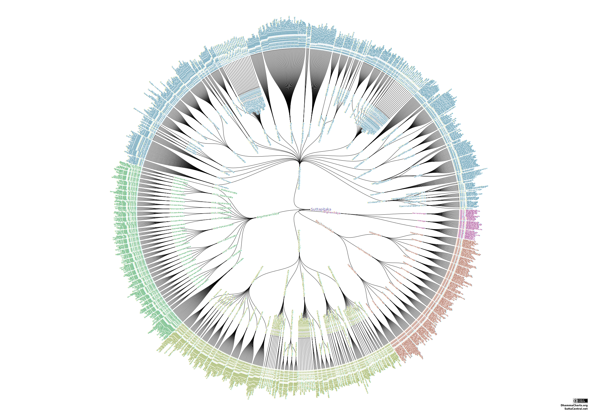

# Sutta Central Parallels
<br>

## Extracting Parallels

On Sutta Central GitHub, we find the folowing file __parallels.json__:


```js
parallels
```

```js echo
const parallels = fetch(
  "https://raw.githubusercontent.com/suttacentral/sc-data/main/relationship/parallels.json"
).then((response) => response.json())
```

We can extract into a simpler array, by removing the # details and the ~ (which means ?):

```js
Inputs.table(parallelsArray)
```

```js echo
const parallelsArray = parallels.map((d) =>
  d.parallels?.map((p) => p.split("#")[0].replace(/~/g, ""))
)
```

## Sutta Pitaka Suttas

We can extract the suttapitaka leaves from [the following chart](https://observablehq.com/d/861e7f60185d063d#chart): 



__Leaves__ are stored in a JSON, after extracting the relevant information from `root.leaves()` we have the following data:

```js
Inputs.table(FileAttachment("./data/leaves.json").json())
```

## Cross Reference

We have __6725 sets__ of parallels and __1119 leaves__. Some leaves represent individual sutta, some represent a range of sutta.

For example the leaf __sn4.21–25__ represent all the suttas from __sn4.21__ to __sn4.25__

We want to populate the 1119 leaves with all their parallels.

With the following function:

```js echo run=false
import fs from 'fs';
import root from '../data/leaves.json' assert { type: 'json' };
import parallels from '../data/parallels.json' assert { type: 'json' };


function addParallelItems(root, parallels) {
    // Helper function to remove duplicates from an array
    function removeDuplicates(array) {
        return [...new Set(array)];
    }

    function parseRange(rangeString) {
        // Split the string by the hyphen to separate start and end values
        const parts = rangeString.split('–'); // Note: This is an en dash, not a regular hyphen (check your input)
    
        // Extract the start and end values // ki22.3–9
        const start = parts[0];  // ki22.3
        const end = parts[1];    // 9
    
        // Check if the start value has a decimal part
        const hasDecimal = start.includes('.');
    
        // If the start value has a decimal part, append it to the end value
        if (hasDecimal) {
            const begining = start.split('.')[0]; // ki22
            return [start, begining + '.' + end];
        }
    
        // If no decimal part, return the original start and end values
        return [start, end];
    }

    // Loop through each item in the root array
    root.forEach((d) => {
        const item = d.facro;
        // Check if the item is a range
        if (item?.includes('–')) {
            const [start, end] = parseRange(item);
            d.range = [start, end] 
            // Loop through each parallel
            parallels.forEach(parallel => {
                // Check if any item in the parallel is within the range
                if (parallel >= start && parallel <= end) {
                    // Add the parallel items to the root item, ensuring no duplicates
                    d.parallels = removeDuplicates([...d.parallels, ...parallel]);
                }
            });
        } else {
            // If the item is not a range, directly check for its presence in parallels
            parallels?.forEach(parallel => {
                if (parallel?.includes(item)) {
                    // Add the parallel items to the root item, ensuring no duplicates
                    d.parallels = removeDuplicates([...d.parallels, ...parallel]);
                }
            });
        }
    });

    return root;
}
const updatedRoot = addParallelItems(root, parallels);

// Write the updatedRoot array to a JSON file
fs.writeFile('../data/leavesWithParallels.json', JSON.stringify(updatedRoot, null, 2), (err) => {
    if (err) throw err;
    console.log('The file has been saved!');
});

```

We get:


```js
Inputs.table(FileAttachment("./data/leavesWithParallels.json").json())
```


